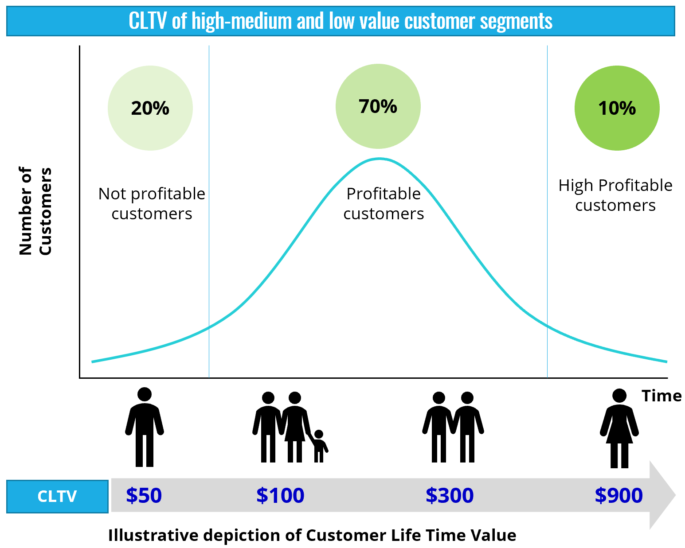

# Customer-Segmentation-and-Lifetime-Value-prediction
Customer LTV Prediction and Customer Segmentation

**Why should companies care about segemneting customers and measuring their lifetime values?**

It's now a known fact that the power of effective Data Science and Analytics has been felt by almost all the business industries with the retail sector being the most impacted. The competition within the retail industry/e-commerce, is growing every day and if a company wants to remain relevant in this industry, using data to capture its customers is definitely one thing to consider. Leveraging the power of data with the aim of using the insights to entice and retain customers as well as generate profits is very important for the survival of every company.

Retail companies use key metrics like total amount spent, average order, how often they order, conversion rate and other important metrics to measure the lifetime of their customers. These metrics can also be used for marketing purposes, like customer segmentation and creating discounts and offers to the appropriate customers. These measurements provide general insight into the behavioural tendencies of customers. Understanding your customers is very important and it could give you a significant edge over your competitors.

These 3 metrics (RFM) are important when analysing customer value

* Recency – How recently did the customer purchase?
* Frequency – How often do they purchase?
* Monetary Value – How much do they spend?

Customer intelligence (CI) is the process of gathering and analyzing information regarding customers – their details and activities – to create efficient and more effective customer relationships and improve decision-making by retail organizations. In a nutshell, for big retail players all over the world, data analytics is applied more these days at all stages of the retail process – tracking popular products that are emerging, forecasting sales and future demand via predictive simulation, optimizing placements of products and offers through heat-mapping of customers and many others.

**PROJECT GOAL**

> * In this project,  I will be focusing on Customer Lifetime Value (LTV) prediction using RFM, Customer Segmentation and (probably) Sale Forecast.
> * Download the dataset [here](https://drive.google.com/drive/folders/1z8uUQBl12Fu-3eY9CGDVd_RfpUipzrj2?usp=sharing)
> * Data_link.txt file contain the link to the dataset on kaggle.com
> * The dataset contain about 23053 customer transactions between (January 2011 to February 2014)

**Project Process**

There are 3 files in the Dataset

Customer.csv: Customer information including demographics

Transaction.csv: Transaction of customers

Product_cat_info.csv : Product information

Data cleaning and Pre-Processing
* Remove null-values
* Check reversed transactions
* Do some feature engineering like customer age
* Drop some unwanted columns
* Merge the 3 dataset
* Change the data type of some of the columns to the appropriate data type

EDA
